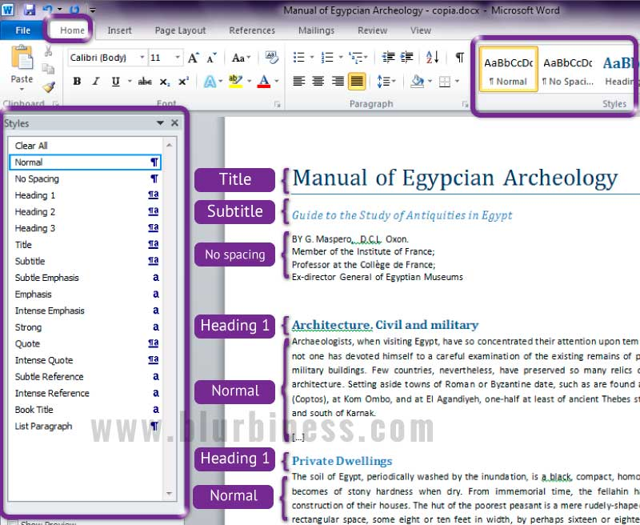
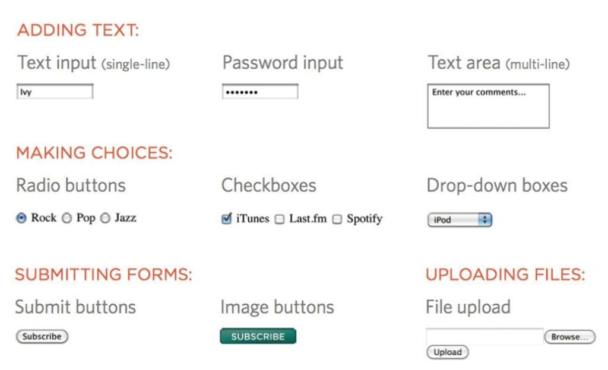

<div align="center">
  
  <h1>#𝔇𝔢𝔰𝔱𝔯𝔬𝔶 𝔱𝔥𝔢 𝔑𝔬𝔯𝔪𝔞𝔩</h1>
</div>

## 🧭 محتويات الجلسة (Session Contents)

| 📁 Folder                                   | 📝 Topic           | 📄 Description                            |
| :------------------------------------------ | :----------------- | :---------------------------------------- |
| [**01-HTML-Basics**](#01-html-basics)       | **HTML Basics**    | Tags, Elements, Attributes, IDs, Classes. |
| [**02-HTML-Structure**](#02-html-structure) | **Page Structure** | Head, Body, Meta tags, Scripts.           |
| [**03-Common-Tags**](#03-common-tags)       | **Common Tags**    | Headings, Paragraphs, Links, Lists, Divs. |
| [**04-Forms-Inputs**](#04-forms-inputs)     | **Forms & Inputs** | Inputs, Select, Checkbox, GET vs POST.    |
| [**05-Tables**](#05-tables)                 | **Tables**         | Rows, Cols, Headings, Spanning.           |

---

# 01-HTML-Basics

## 🧠 1️⃣ HTML يعني إيه؟

- **HTML** = لغة لوصف محتوى صفحات الويب.
- **استخداماتها**: العناوين، النصوص، الروابط، القوائم.
- **مش لغة برمجة**: دي لغة ترتيب وهيكل.

### 💡 Analogy: Start with MS Word

Think of HTML like a Word Document.
When you write in Word, you choose:

- **Big Title** (Heading 1)
- **Subtitle** (Heading 2)
- **Paragraph text**
- **Bold/Italic**

HTML does the EXACT same thing, but with code.



### Example

```html
<h1>Hello World</h1>
{{ ... }}
```

---

## 2️⃣ Tag / Element / Attribute

### 🔹 Tag

كلمة بتتكتب بين علامات `< >`:

- **Open Tag**: `<p>` (البداية)
- **Close Tag**: `</p>` (النهاية)

### 🔹 Element

هو "العنصر الكامل": (البداية + المحتوى + النهاية).

**Structure Breakdown**

```
Element
   👇
 <p> Hello World </p>
  👆      👆      👆
  Tag   Content  Closing Tag
```

| Part             | Code           |
| :--------------- | :------------- |
| **Opening Tag**  | `<p>`          |
| **Content**      | `Hello`        |
| **Closing Tag**  | `</p>`         |
| **Full Element** | `<p>Hello</p>` |

### Attribute

معلومة صغيرة جوه التاج بتحدد خصائص العنصر.
شكلها: `name="value"`

### Example Attributes

```html
<a href="https://google.com" target="_blank">Google</a>
<p class="text">Hello!</p>
<input type="text" name="username" placeholder="Enter your name" />
```

---

## 3️⃣ Self-Closing Tags

بعض العناصر **ملهاش محتوى جوه** → مش محتاجة تاج إغلاق.

```html
<br />
<hr />
```

---

## 4️⃣ id / class / name

### class

- لتكرار الشكل على أكتر من عنصر
- CSS Selector: `.className`

### id

- فريد لعنصر واحد
- CSS Selector: `#idName`

### name

- غالبًا في الفورمز
- CSS Selector: `[name="username"]` (مثال)

### Example HTML + CSS

```html
<h1 id="main-title">Welcome to the page</h1>
<p class="info">Paragraph 1</p>
<p class="info">Paragraph 2</p>
<input type="text" name="username" placeholder="Enter your name" />
```

```css
#main-title {
  color: blue;
}

.info {
  color: green;
}

input[name="username"] {
  border: 2px solid red;
}
```

### 📂 Practical Example

Go to folder `01-HTML-Basics` to see the code in action!

---

# 02-HTML-Structure

## 🧠 1️⃣ الهيكل الأساسي لأي صفحة HTML

كل صفحة HTML ليها **هيكل أساسي ثابت**:

```html
<!DOCTYPE html>
<html>
  <head>
    <title>Page Title</title>
  </head>
  <body>
    <!-- Content goes here -->
  </body>
</html>
```

**Explanation:**

- `<!DOCTYPE html>` → بيقول للمتصفح إن دي صفحة HTML5
- `<html>` → بداية الصفحة كلها
- `<head>` → مكان المعلومات اللي مش بتظهر على الصفحة زي العنوان، الروابط للـ CSS أو الـ meta tags
- `<title>` → عنوان الصفحة اللي بيظهر في التاب بتاع المتصفح
- `<body>` → كل حاجة المستخدم يشوفها: نصوص، صور، روابط، أزرار…

---

## 2️⃣ أهم العناصر داخل `<head>`

### **meta**

- معلومات عن الصفحة زي الترميز، الوصف، أو الكلمات المفتاحية
  **مثال:**

```html
<meta charset="UTF-8" />
```

- **ليه مهم؟**: عشان المتصفح يفهم الحروف العربي والرموز (Emojis) ويظهرها صح. من غيره الكلام ممكن يبان رموز غريبة. 😵‍💫

```html
<meta name="description" content="This is my website" />
```

### **link**

- بيربط الصفحة بـ CSS خارجي
  **مثال:**

```html
<link rel="stylesheet" href="style.css" />
```

### **script**

- لو هتستخدم JavaScript
  **مثال:**

```html
<script src="script.js"></script>
```

---

### 📂 Practical Example

Go to folder `02-HTML-Structure` to see the code in action!

---

# 03-Common-Tags

### 1️⃣ العناوين (Headings)

HTML عنده 6 مستويات للعناوين: `<h1>` لـ `<h6>`

- `<h1>` → أهم عنوان
- `<h6>` → أقل أهمية

**Example:**

```html
<h1>Main Heading</h1>
<h2>Sub Heading</h2>
<h3>Smaller Heading</h3>
```

### 2️⃣ الفقرات والتحكم في النص (Paragraphs & Text Control)

#### Paragraphs & Line Breaks

- `<p>` → paragraph → مسافة بين الفقرات تلقائي
- `<br>` → line break → سطر جديد بدون paragraph

```html
<p>This is paragraph one.</p>
<p>This is paragraph two.</p>
<p>This line<br />breaks here.</p>
```

#### Horizontal Rule

- `<hr>` → خط أفقي لتقسيم المحتوى

```html
<p>Before the line</p>
<hr />
<p>After the line</p>
```

#### Whitespace & Preformatted Text

- HTML بتتجاهل المسافات الزايدة والـ newlines
- استخدم `<pre>` أو CSS `white-space: pre` للحفاظ على المسافات

```html
<p>This text has multiple spaces.</p>
<pre>
This      text      preserves      spaces
and
line breaks
</pre>
```

### 3️⃣ الروابط (Links)

- `<a>` → لإنشاء رابط
- `href="URL"`: العنوان (Destination).
- `target="_blank"`: فتح في تاب جديد.
- `target="_self"`: فتح في نفس الصفحة.

```html
<a href="https://google.com" target="_blank">Visit Google</a>
```

### 4️⃣ القوائم (Lists)

#### Unordered List (نقاط)

```html
<ul>
  <li>Item 1</li>
  <li>Item 2</li>
</ul>
```

#### Ordered List (مرقمة)

```html
<ol>
  <li>First</li>
  <li>Second</li>
</ol>
```

#### Definition List (قوائم تعريفية)

- `<dl>` → قائمة تعريفية
- `<dt>` → المصطلح
- `<dd>` → التعريف أو الوصف

```html
<dl>
  <dt>HTML</dt>
  <dd>HyperText Markup Language</dd>
</dl>
```

#### Nested Lists (قوائم متداخلة)

```html
<ul>
  <li>
    Fruits
    <ul>
      <li>Apple</li>
    </ul>
  </li>
</ul>
```

### 5️⃣ الهيكلة (Structure)

#### Div & Span

- `<div>` → بلوك كبير لتقسيم الصفحة (Container).
- `<span>` → عنصر صغير جوه نص أو عنصر تاني.

#### Inline vs Block Elements

- **Block** → تاخد كل السطر: `<p>, <div>, <h1>`
- **Inline** → جوه السطر: `<span>, <b>, <i>, <a>`

```html
<div class="container">
  <p>This is a <span style="color:red">red text</span> inside a paragraph.</p>
</div>
```

#### Address

- `<address>` → بيانات الكاتب أو جهة الاتصال

```html
<address>
  Written by John Doe.<br />
  Email: <a href="mailto:johndoe@example.com">johndoe@example.com</a>
</address>
```

### 6️⃣ تنسيق النصوص (Text Formatting)

#### Bold & Strong

- `<b>` → نص bold بدون معنى سيمياني
- `<strong>` → نص مهم/مؤكد → عادة بيظهر bold

```html
<p>This is <b>bold text</b> and this is <strong>strong text</strong>.</p>
```

#### Italic & Emphasis

- `<i>` → نص italic بدون معنى سيمياني
- `<em>` → نص مؤكد → عادة بيظهر italic

```html
<p>This is <i>italic text</i> and this is <em>emphasized text</em>.</p>
```

#### Underline

- `<u>` → نص تحته خط

```html
<p>This is <u>underlined text</u>.</p>
```

#### Superscript & Subscript

- `<sup>` → نص فوق السطر (superscript)
- `<sub>` → نص تحت السطر (subscript)

```html
<p>H<sub>2</sub>O is water.</p>
<p>E = mc<sup>2</sup></p>
```

#### Mark & Deleted / Inserted Text

- `<mark>` → لتسليط الضوء على النص
- `<del>` → نص اتحذف
- `<ins>` → نص اتحط جديد

```html
<p>This is <mark>highlighted</mark> text.</p>
<p><del>Old text</del> <ins>New text</ins></p>
```

#### Small & Big Text

- `<small>` → نص أصغر
- `<big>` → نص أكبر

```html
<p>This is <small>small text</small> and this is <big>big text</big>.</p>
```

### 7️⃣ عناصر أخرى (Others)

#### Quotation & Citation

- `<q>` → اقتباس قصير inline
- `<blockquote>` → اقتباس طويل block
- `<cite>` → مصدر أو مؤلف

```html
<p>He said <q>Hello World</q>.</p>
<blockquote>This is a long quote from a famous person.</blockquote>
<p>Source: <cite>John Doe</cite></p>
```

#### Abbreviation & Acronyms

- `<abbr>` → اختصار مع تعريف عند hover

```html
<p>The <abbr title="World Health Organization">WHO</abbr> is global.</p>
```

### 8️⃣ الصور (Images)

- `` → لإضافة صورة.
- **Attributes:**
  - `src` → مسار الصورة (Source).
  - `alt` → نص بديل لو الصورة ماظهرتش (Alternative Text).
  - `width` → العرض.
  - `height` → الطول.

```html

```

### 9️⃣ الفيديوهات (Videos)

- `<video>` → لإضافة فيديو.
- **Attributes:**
  - `src` → مسار الفيديو (ممكن تستخدم `<source>` جواه).
  - `controls` → عشان تظهر أزرار التشغيل والوقف.
  - `width` / `height` → التحكم في الحجم.
  - `autoplay` → تشغيل تلقائي.
  - `loop` → إعادة تشغيل تلقائي.
  - `muted` → كتم الصوت.
  - `poster` → صورة تظهر قبل التشغيل.

```html
<video width="320" height="240" controls>
  <source src="movie.mp4" type="video/mp4" />
  Your browser does not support the video tag.
</video>
```

### 🔟 آي فريم (IFrame)

- بيعرض صفحة ويب تانية جوه صفحتك.
- **أهم Attributes:**
  - `src` → الصفحة اللي هتتعرض.
  - `width` / `height` → حجم الـ iframe.
  - `frameborder` → يظهر إطار ولا لأ (0 أو 1).
  - `scrolling` → يظهر Scroll ولا لأ (yes, no, auto).
  - `allowfullscreen` → تشغيل المحتوى Fullscreen.

**Example:**

```html
<iframe src="https://example.com" width="400" height="250" frameborder="0">
</iframe>
```

**أهم استخدام:**
عرض محتوى خارجي جاهز جوّه صفحتك (زي YouTube videos أو Google Maps أو أي صفحة تانية).

### 📂 Practical Example

Go to folder `03-Common-Tags` to see the code in action!

---

# 04-Forms-Inputs

<div align="center">
  
</div>

### 1️⃣ Form Basics

- `<form>` → العنصر اللي بيجمع كل الحقول ويرسل البيانات.
- **أهم Attributes:**
  - `action` → الرابط اللي هتتبعت له البيانات.
  - `method` → طريقة الإرسال (`GET` أو `POST`).
  - `enctype` → لو فيه رفع ملفات (`multipart/form-data`).

**Example:**

```html
<form action="/submit" method="POST" enctype="multipart/form-data">
  <!-- inputs here -->
</form>
```

### 2️⃣ Attributes مهمة لكل Input

**Example:**

```html
<input type="text" name="username" placeholder="Enter Name" required disabled />
```

| Attribute     | Function                                   |
| :------------ | :----------------------------------------- |
| `type`        | نوع الحقل (`text`, `password`, `email`...) |
| `name`        | اسم الحقل → مهم لإرسال البيانات للسيرفر    |
| `placeholder` | نص يظهر جوه الحقل قبل الكتابة              |
| `value`       | القيمة الافتراضية للحقل أو نص الزر         |
| `required`    | يجبر المستخدم على ملء الحقل                |
| `min`, `max`  | للأرقام، الحد الأدنى والأقصى               |
| `checked`     | لخانات متظبطة مسبقًا (checkbox/radio)      |
| `readonly`    | الحقل للقراءة فقط                          |
| `disabled`    | الحقل غير نشط                              |

### 3️⃣ Input Types

#### **1. text**

- حقل نص عادي.

```html
<input type="text" name="username" placeholder="Enter your name" required />
```

#### **2. password**

- حقل كلمة سر مخفي.

```html
<input
  type="password"
  name="password"
  placeholder="Enter your password"
  required
/>
```

#### **3. email**

- يتحقق من صيغة البريد الإلكتروني.

```html
<input type="email" name="email" placeholder="Enter your email" required />
```

#### **4. number**

- يقبل أرقام بس.

```html
<input
  type="number"
  name="age"
  placeholder="Enter your age"
  min="1"
  max="100"
  required
/>
```

#### **5. Submit Button (`<input>` vs `<button>`)**

- `input type="submit"`: زر إرسال الفورم (الطريقة القديمة).
- `<button type="submit">`: الطريقة الأحدث والأقوى.
  - ممكن تحط جواه أيقونات أو تشكيله (HTML Content).
  - **Types:**
    - `type="submit"` (default): يرسل الفورم.
    - `type="reset"`: يمسح البيانات.
    - `type="button"`: زر عادي (مبتعملش حاجة غير بـ JS).

```html
<!-- Old Way -->
<input type="submit" value="Submit" />

<!-- Modern Way 🚀 -->
<button type="submit">Register Now</button>
```

#### **6. reset**

- زر إعادة تعيين الحقول.

```html
<input type="reset" value="Reset" />
```

#### **7. checkbox**

- اختيار واحد أو أكتر.

```html
<input type="checkbox" name="subscribe" value="newsletter" /> Subscribe
```

#### **8. radio**

- اختيار واحد من مجموعة.

```html
<input type="radio" name="gender" value="male" /> Male
<input type="radio" name="gender" value="female" /> Female
```

#### **9. file**

- رفع ملفات.

```html
<input type="file" name="profile-pic" />
```

#### **10. hidden**

- حقل مخفي للمستخدم.

```html
<input type="hidden" name="userId" value="12345" />
```

### 4️⃣ Textarea & Select

#### **Textarea**

- للنصوص الكبيرة (زي الرسائل).

```html
<textarea
  name="message"
  placeholder="Enter your message"
  rows="5"
  cols="30"
></textarea>
```

#### **Select & Option**

- قائمة منسدلة.

```html
<select name="country">
  <option value="eg">Egypt</option>
  <option value="us">USA</option>
  <option value="uk">UK</option>
</select>
```

### 5️⃣ Labels

#### **Label (`<label>`)**

- بيربط نص توضيحي بحقل الإدخال.
- **مهم جدًا:** لما تدوس على الـ Label، المتصفح بيعمل Focus على الـ Input.
- لازم `for` بتاعة الـ Label تكون نفس الـ `id` بتاعة الـ Input.

```html
<label for="user">Username:</label>
<input type="text" id="user" name="username" />
```

### 6️⃣ POST vs GET

#### **GET**

- البيانات بتتبعت في **الرابط (URL)**.
- كويس للبحث أو بيانات بسيطة.
- Limit للبيانات.

```html
<form action="/search" method="GET">
  <input type="text" name="query" />
  <input type="submit" value="Search" />
</form>
```

#### **POST**

- البيانات بتتبعت **في جسم الطلب (Request Body)**.
- مناسب للبيانات الحساسة أو الملفات.

```html
<form action="/submit" method="POST">
  <input type="text" name="username" />
  <input type="password" name="password" />
  <input type="submit" value="Login" />
</form>
```

**البلدي (Summary):**

- **GET** → البيانات تظهر في الرابط → للبحث أو بيانات عامة.
- **POST** → البيانات مش تظهر في الرابط → للملفات وكلمات السر.

### 📂 Practical Example

Go to folder `04-Forms-Inputs` to see the code in action!

---

# 05-Tables

## 🟦 **Complete Guide — Tables**

### 1️⃣ What is a Table?

الـ Table عبارة عن بيانات معمولة في صفوف Rows و أعمدة Columns.

**العناصر الأساسية:**

- `<table>` → بيحدد إن عندي جدول.
- `<tr>` → Table Row → صف.
- `<td>` → Table Data → خلية عادية في الصف.

**Example:**

```html
<table>
  <tr>
    <td>15</td>
    <td>30</td>
    <td>45</td>
  </tr>
  <tr>
    <td>60</td>
    <td>90</td>
    <td>120</td>
  </tr>
</table>
```

</table>
```

**Output:**

<table>
  <tr>
    <td>15</td>
    <td>30</td>
    <td>45</td>
  </tr>
  <tr>
    <td>60</td>
    <td>90</td>
    <td>120</td>
  </tr>
</table>

### 2️⃣ Table Headings `<th>`

لما تحب تعمل عنوان للعمود أو الصف، بتستخدم `<th>` بدل `<td>`.

**Example:**

```html
<table>
  <tr>
    <th scope="col">Saturday</th>
    <th scope="col">Sunday</th>
  </tr>
  <tr>
    <th scope="row">Tickets Sold</th>
    <td>120</td>
    <td>135</td>
  </tr>
</table>
```

</table>
```

**Output:**

<table>
  <tr>
    <th scope="col">Saturday</th>
    <th scope="col">Sunday</th>
  </tr>
  <tr>
    <th scope="row">Tickets Sold</th>
    <td>120</td>
    <td>135</td>
  </tr>
</table>

**ليه scope مهم؟**

- `scope="col"` → عنوان لعمود
- `scope="row"` → عنوان لصف
- ➜ يساعد الـ screen readers (accessibility).

### 3️⃣ Spanning Columns – colspan

لو عايز خلية تمتد على أكتر من عمود:

```html
<td colspan="2">Geography</td>
```

```html
<td colspan="2">Geography</td>
```

**Output:**

<table>
  <tr>
    <td>Math</td>
    <td colspan="2" style="background-color:#e0e0e0; text-align:center;">Geography (colspan=2)</td>
    <td>Physics</td>
  </tr>
  <tr>
    <td>80</td>
    <td>90</td>
    <td>85</td>
    <td>92</td>
  </tr>
</table>

### 4️⃣ Spanning Rows – rowspan

لو خلية تمتد على أكتر من صف:

```html
<td rowspan="2">Movie</td>
```

```html
<td rowspan="2">Movie</td>
```

**Output:**

<table>
  <tr>
    <td rowspan="2" style="background-color:#e0e0e0; vertical-align:middle;">Movie (rowspan=2)</td>
    <td>Inception</td>
  </tr>
  <tr>
    <td>Interstellar</td>
  </tr>
</table>

### 5️⃣ Long Tables

في الجداول الكبيرة، بنقسم الجدول 3 أجزاء:

1.  `<thead>` → عناوين الجدول
2.  `<tbody>` → بيانات الجدول الأساسية
3.  `<tfoot>` → إجمالي / ملاحظات / نهاية الجدول

**Example:**

```html
<table>
  <thead>
    <tr>
      <th>Date</th>
      <th>Income</th>
      <th>Expenditure</th>
    </tr>
  </thead>

  <tbody>
    <tr>
      <td>18th January</td>
      <td>212</td>
      <td>39</td>
    </tr>
  </tbody>

  <tfoot>
    <tr>
      <td>Total</td>
      <td>7824</td>
      <td>1241</td>
    </tr>
  </tfoot>
</table>
```

</table>
```

**Output:**

<table>
  <thead>
    <tr style="background-color:#f0f0f0;">
      <th>Date</th>
      <th>Income</th>
      <th>Expenditure</th>
    </tr>
  </thead>
  <tbody>
    <tr>
      <td>18th January</td>
      <td>212</td>
      <td>39</td>
    </tr>
  </tbody>
  <tfoot>
    <tr style="font-weight:bold;">
      <td>Total</td>
      <td>7824</td>
      <td>1241</td>
    </tr>
  </tfoot>
</table>

### 📂 Practical Example

Go to folder `05-Tables` to see the code in action!
